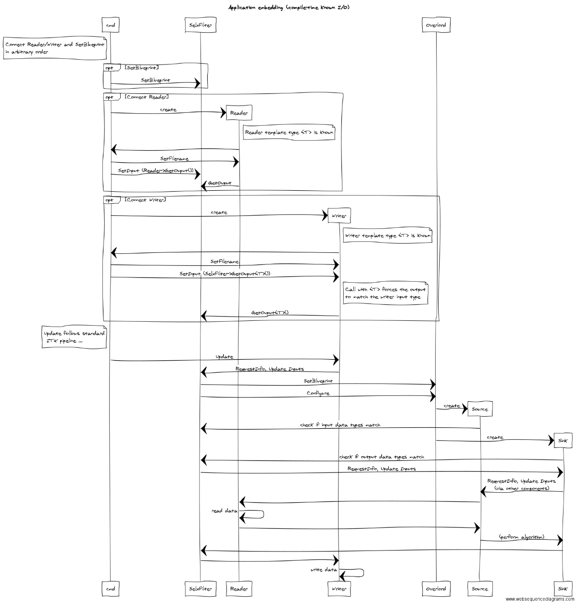
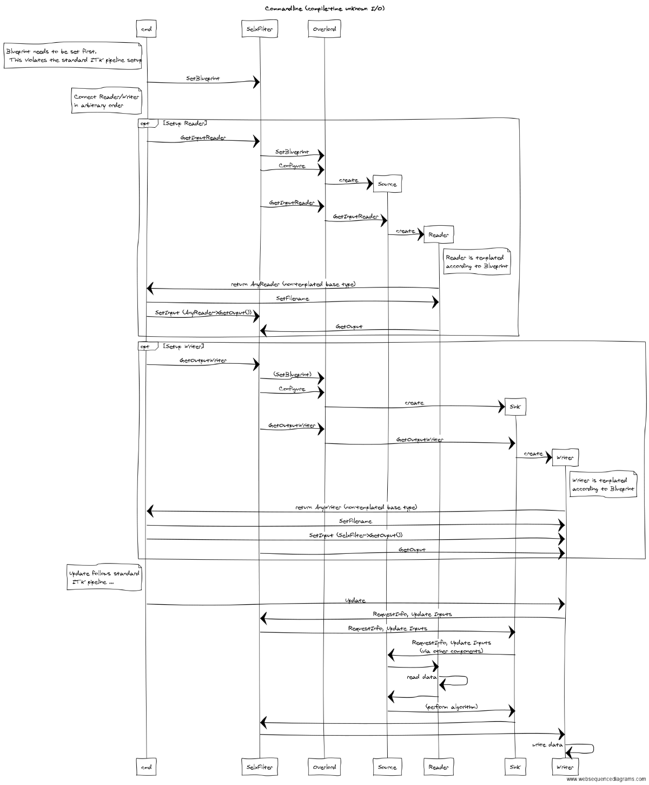

.. _Development:

Development
===============

Design of the SuperElastixFilter
--------------------------------

The SuperElastixFilter is designed to be part of an itk pipeline such that it can connect to other itk filters and supports the itk update mechanism. All input and output data required by the (configured) algorithm are exposed by the SuperElastixFilter. In this philosophy the SuperElastixFilter does/should not read or write data (images, meshes, etc) from disk directly. Therefor, in the commandline tool, which uses the SuperElastixFilter, readers and writers reside outside the SuperElastixFilter.
However, unlike common itk filters, the inputs and outputs of the SuperElastixFilter are typically unknown at compile time, because they depend on the Blueprint configuration describing the actual algorithm to execute. This complicates the setup of a pipeline, since up and downstream itk filters are typically templated over their datatypes.
To stay as close as possible to the itk philosophy, the SuperElastixFilter supports 2 modes of operation:

- *Application embedding*: at compile-time the inputs and outputs are known. That is, the application developer makes sure that any Blueprints to be used, will correspond to the (compile-time defined) number and types of inputs and outputs by known identifier names (defined by the Sink and Source Components). In this mode, the order in which the inputs and outputs are connected to other filters, and the Blueprint (Object) is set, is arbitrary. However, to connect the output of the SuperElastixFilter a templated version of GetOutput must be used: ImageFileReader<KnownImageType>::Pointer my_writer->SetInput(selxFilter->GetOutput<KnownImageType>(identifier));
- *Commandline tool*: at compile time the inputs and outputs are unknown. The class implementing the commandline interface is not aware of the datatypes used by all components. (In this way, adding custom components with new types does not affect the source code of the commandline interface). The commandline interface is invoked by pairs of filenames and identifier names. The identifiers refer to Sink or Source Components as defined via the Blueprint that, in turn, define the data types. In this mode, the commandline interface cannot instantiate the readers or writers because of their templated types. Instead, the SuperElastixFilter is requested to return appropriate readers and writers corresponding to the identifier names. SuperElastix will return respectively an AnyReader or AnyWriter, which are non-templated Base Classes that, if updated, call the appropriate reader of writer (by use of polymorphism). In this mode, it is required to set the Blueprint prior to request and connect readers or writers.

The following sequence diagrams show the order of function calls of each mode of operation.

Note that these are simplified diagrams and may not reflect all details and naming as found in the source code.